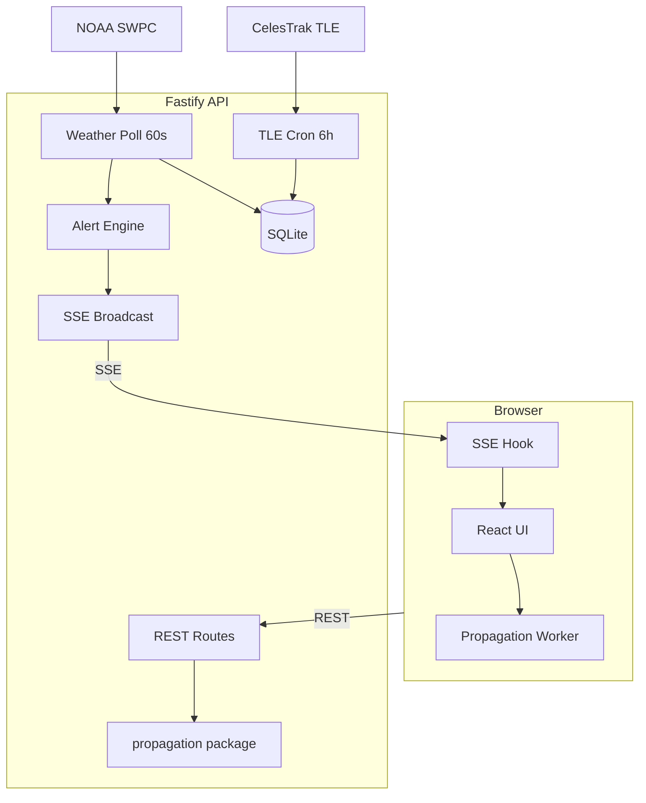

# UPLINK Architecture

## Overview

UPLINK is a monorepo with three deployable concerns:

1. **apps/web** — React SPA with WebGL globe and mission control UI
2. **apps/api** — Fastify REST + SSE server
3. **packages/propagation** — Shared SGP4 orbital math (used by API and Web Worker)

Storage uses Node.js 22+ built-in **`node:sqlite`** (no native `better-sqlite3` build step).

## Data Flow



## Pass Prediction Pipeline

1. Client requests `/v1/passes/iss?lat=&lon=`
2. API loads TLE from SQLite, creates `satrec`
3. Coarse 30s elevation scan over 7 days
4. Binary search refines AOS/LOS to 1 second
5. Result cached in `pass_cache` for 15 minutes

## Space Weather Pipeline

1. Cron polls NOAA JSON endpoints every 60s
2. Parser handles legacy and new numeric JSON formats
3. Alert rules evaluated (Kp, solar wind, Bz, flares)
4. Deduplication prevents repeat alerts within 30 minutes
5. SSE pushes `weather.update` and `alert.fired` events

## Comms Degradation Score

```
score = clamp(0, 100, (Kp × 8) + (wind > 500 ? 15 : 0) + (Bz < -5 ? 20 : 0))
```

Mapped to globe ionosphere ring color: cyan (normal) → amber (warning) → red (critical).

## Database Schema

- `satellites` — Latest TLE per NORAD ID
- `space_weather_snapshots` — Time series cache
- `alerts` — Fired alert history
- `geocode_cache` — Nominatim results (24h TTL)
- `pass_cache` — Computed passes (15 min TTL)

## Performance

- Globe position ticks: 1 Hz in Web Worker (40 satellites < 16ms)
- Ground tracks: recomputed on satellite selection only
- react-globe.gl lazy-loaded via React `Suspense`
- API pass prediction target: < 50ms per request
